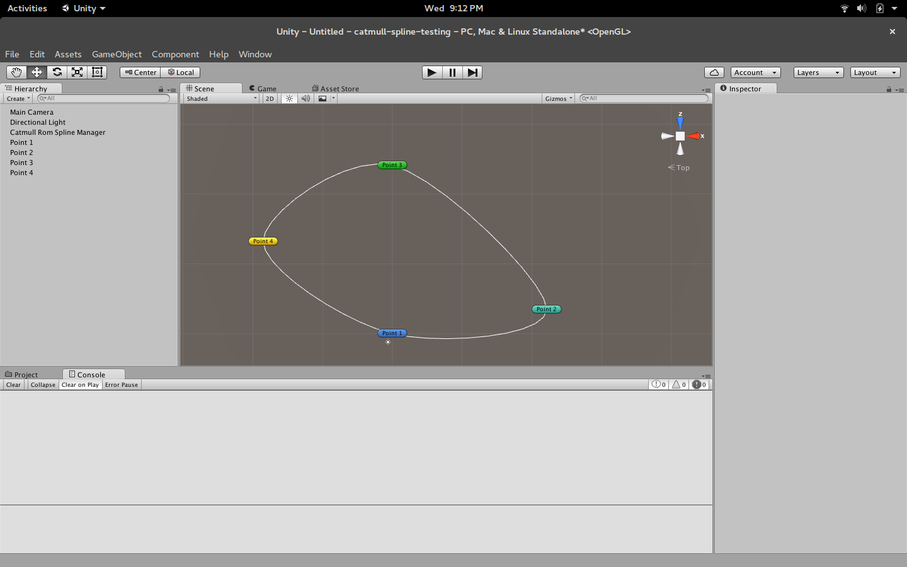

## What is this repository?
I wanted to try out Catmull Rom Splines to see how they look when they're drawn on Unity. These splines can be used in integration with Unity's NavMesh or some path finding algorithm just to make "smoother" lines than rigid lines found commonly in pathfinding algorithms.

## In the end I got this:

## Stuff on the TODO
Really, I coded this in half an hour. You'll get plenty of null references, I'll fix that later.
